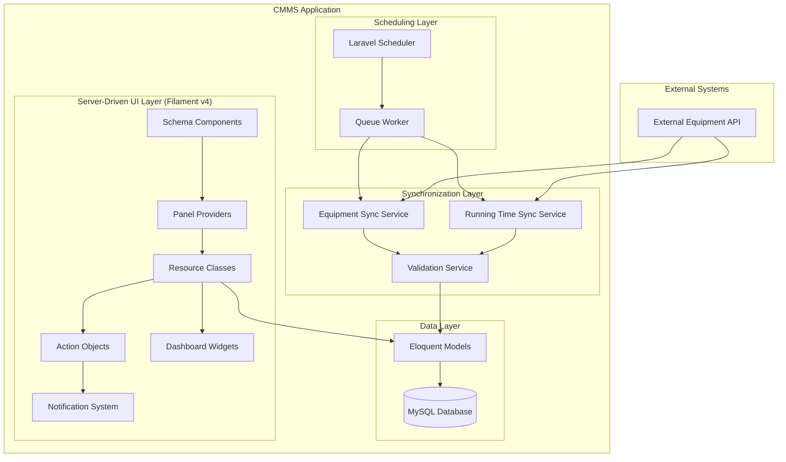
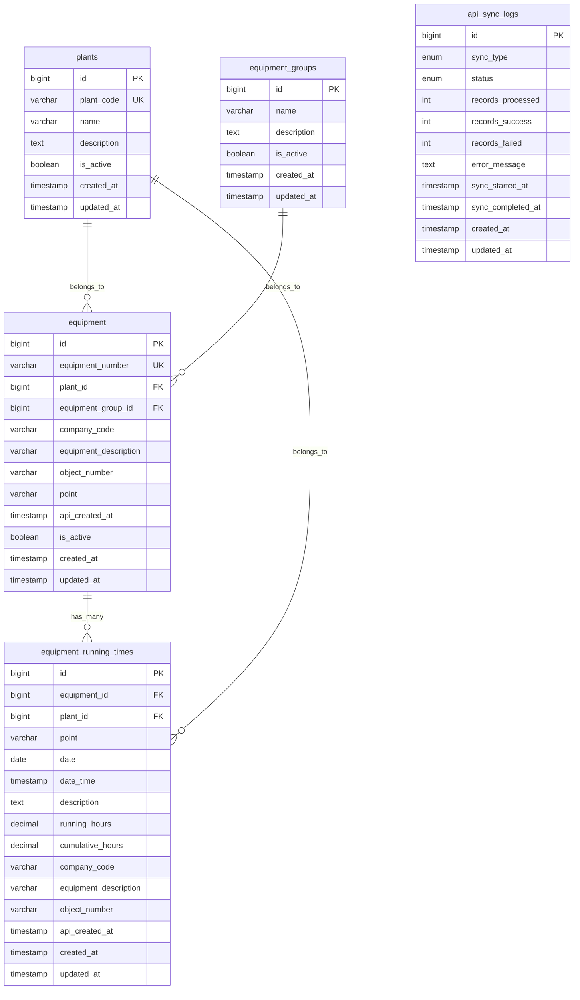
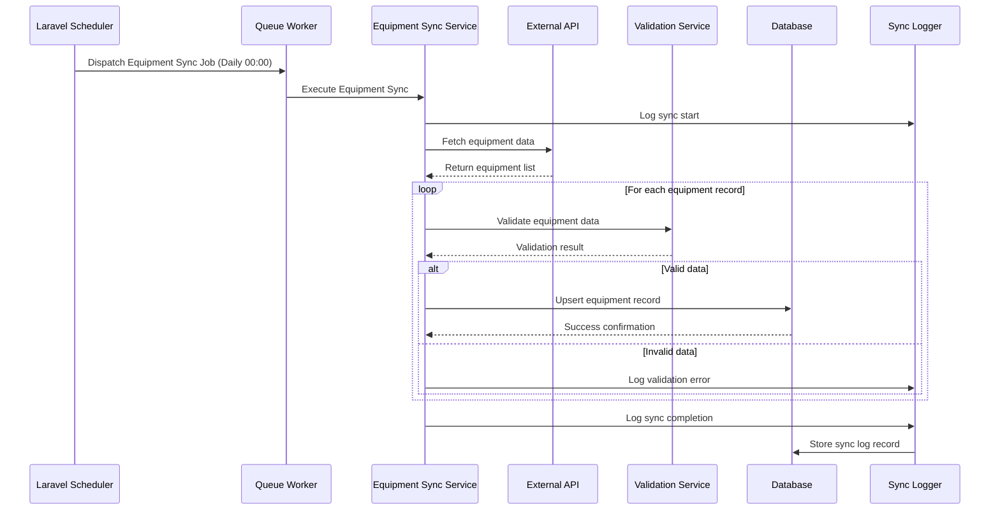
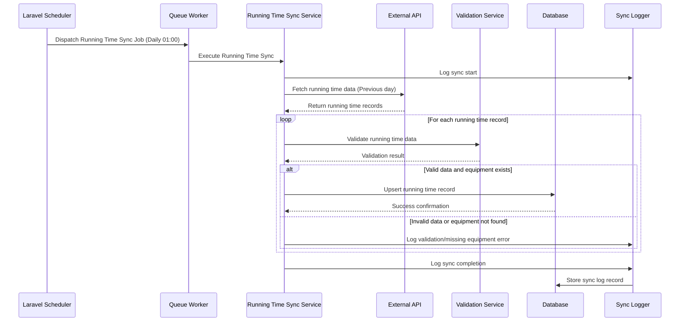
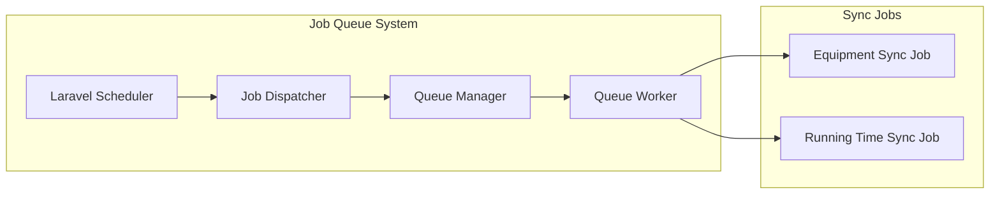
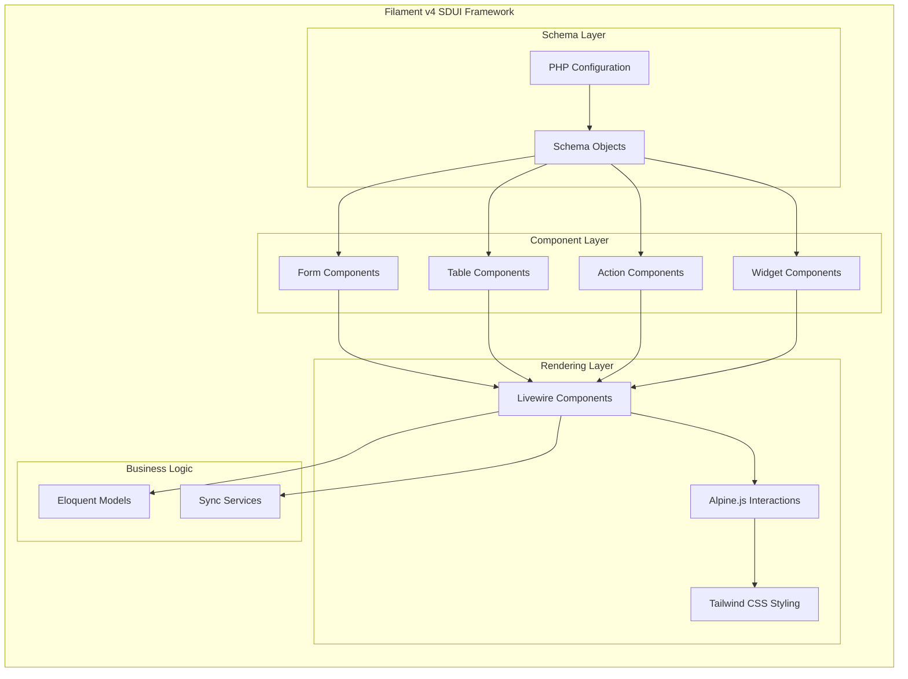
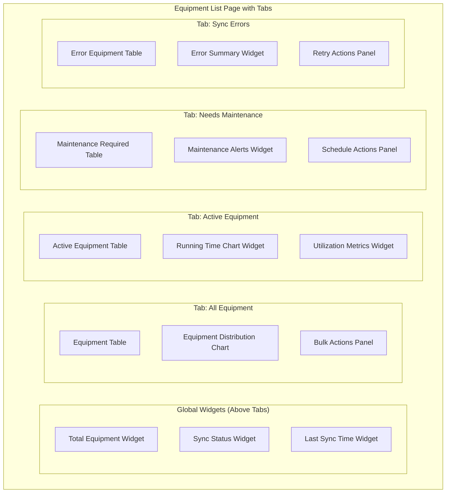
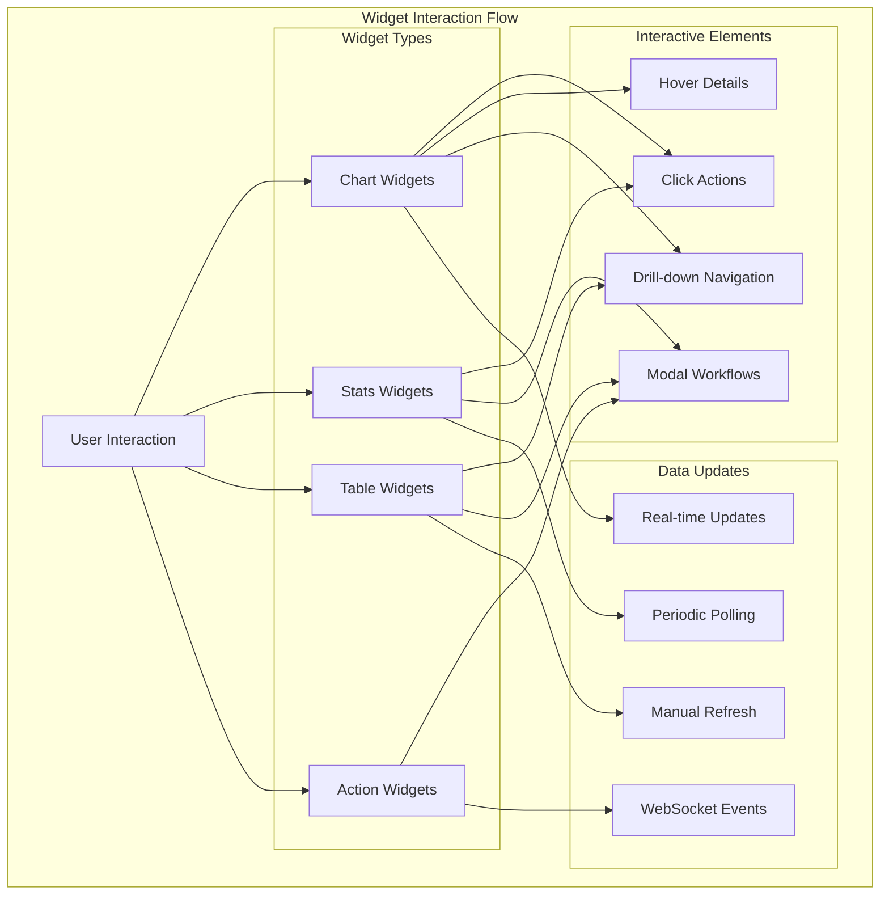
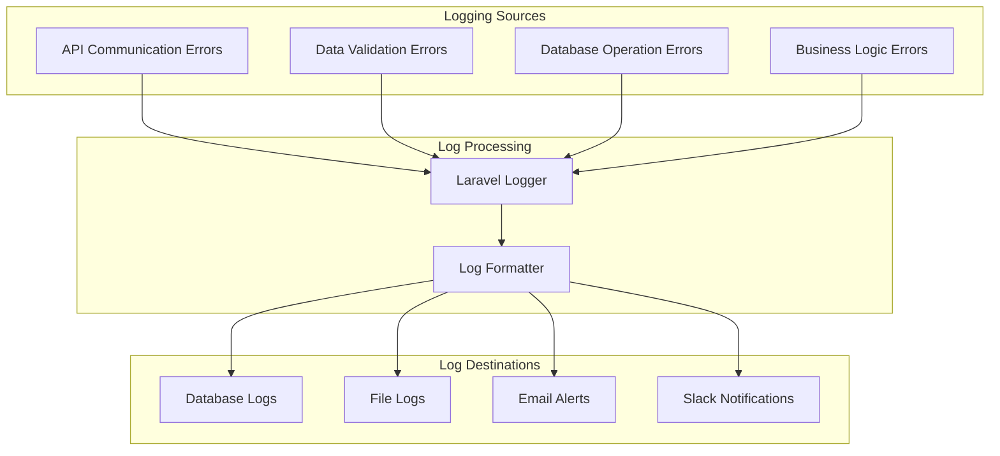

# Database Synchronization Automation Design

## Overview

This design outlines the database synchronization automation system for the CMMS (Computerized Maintenance Management System). The system enables automated daily synchronization of equipment master data and running time data from external APIs into the local database, ensuring real-time equipment monitoring and maintenance management capabilities.

**Primary Objectives:**
- Automate daily synchronization of equipment and running time data from external APIs
- Provide data integrity and error handling mechanisms
- Enable monitoring and alerting based on equipment running hours
- Support scalable data processing for large equipment inventories
- Maintain audit trails for synchronization operations

## Technology Stack & Dependencies

| Component | Technology | Purpose |
|-----------|------------|---------|
| Backend Framework | Laravel 12 | Core application framework |
| Admin Panel | Filament 4 (SDUI Framework) | Server-driven UI for administrative interface |
| UI Architecture | Schema-based Components | Declarative UI configuration using PHP objects |
| Database | MySQL | Primary data storage |
| Queue System | Laravel Queue | Background job processing |
| Task Scheduling | Laravel Scheduler | Automated daily synchronization |
| API Client | Laravel HTTP Client | External API communication |
| ORM | Eloquent | Database abstraction layer |
| Frontend Stack | Livewire + Alpine.js + Tailwind CSS | Reactive UI components without custom JavaScript |

## Architecture

### High-Level System Architecture

### Database Schema Architecture

## Data Synchronization Flow

### Equipment Synchronization Process

### Running Time Synchronization Process

## Data Models

### Core Entity Models

| Model | Primary Purpose | Key Relationships |
|-------|----------------|-------------------|
| Plant | Location/facility management | Has many Equipment |
| EquipmentGroup | Equipment categorization | Has many Equipment |
| Equipment | Equipment master data | Belongs to Plant, EquipmentGroup; Has many EquipmentRunningTime |
| EquipmentRunningTime | Daily running hour tracking | Belongs to Equipment, Plant |
| ApiSyncLog | Synchronization audit trail | Standalone logging entity |

### Data Validation Rules

| Field | Validation Rules | Business Logic |
|-------|-----------------|----------------|
| Equipment Number | Required, Unique, Max 50 chars | Primary identifier from API |
| Plant Code | Required, Must exist in plants table | Foreign key validation |
| Running Hours | Required, Numeric, Min 0 | Daily operation hours |
| Cumulative Hours | Required, Numeric, Min 0, Greater than previous day | Total lifetime hours |
| Date | Required, Date format, Unique per equipment | No duplicate dates per equipment |
| API Created At | Required, Valid timestamp | Source system timestamp |

### API Data Mapping

| API Field | Database Field | Transformation |
|-----------|---------------|----------------|
| SWERK | plants.plant_code | Direct mapping |
| EQUNR | equipment.equipment_number | Direct mapping |
| BUKRS | equipment.company_code | Direct mapping |
| EQKTU | equipment.equipment_description | Direct mapping |
| OBJNR | equipment.object_number | Direct mapping |
| POINT | equipment.point | Direct mapping |
| DATE | equipment_running_times.date | Date format conversion |
| DATE_TIME | equipment_running_times.date_time | Timestamp conversion |
| RECDV | equipment_running_times.running_hours | Decimal conversion |
| CNTRR | equipment_running_times.cumulative_hours | Decimal conversion |
| MDTXT | equipment_running_times.description | Direct mapping |
| CREATED_AT | api_created_at | Timestamp conversion |

## Synchronization Services Architecture

### Equipment Synchronization Service

**Responsibilities:**
- Fetch equipment master data from external API
- Validate equipment data integrity
- Create or update equipment records using upsert operations
- Handle plant association and equipment group classification
- Log synchronization results and errors

**Key Operations:**
- API endpoint consumption with authentication
- Data transformation and normalization
- Duplicate detection and prevention
- Error handling and recovery mechanisms
- Batch processing for large datasets

### Running Time Synchronization Service

**Responsibilities:**
- Fetch daily running time data from external API
- Validate equipment existence before inserting running time records
- Ensure data consistency with cumulative hour calculations
- Handle missing or duplicate date entries
- Process equipment-specific running hour data

**Key Operations:**
- Date-based data filtering (previous day sync)
- Equipment lookup and validation
- Cumulative hour progression validation
- Unique constraint handling for equipment-date combinations
- Error logging for orphaned running time data

### Validation Service

**Data Integrity Checks:**
- Required field validation
- Data type and format validation
- Business rule validation (cumulative hours progression)
- Foreign key constraint validation
- Duplicate prevention logic

**Error Classification:**
- Critical errors (stop processing)
- Warning errors (log and continue)
- Informational messages (successful operations)

## Queue System & Job Processing

### Job Queue Architecture

### Job Scheduling Strategy

| Job Type | Schedule | Priority | Timeout | Retry Policy |
|----------|----------|----------|---------|--------------|
| Equipment Sync | Daily 00:00 | High | 30 minutes | 3 retries with exponential backoff |
| Running Time Sync | Daily 01:00 | High | 60 minutes | 3 retries with exponential backoff |
| Sync Log Cleanup | Weekly | Low | 10 minutes | 1 retry |

### Error Handling & Recovery

**Retry Mechanisms:**
- Automatic retry for transient API failures
- Exponential backoff strategy for rate limiting
- Manual retry capability through Filament admin panel
- Dead letter queue for failed jobs requiring manual intervention

**Failure Notifications:**
- Email alerts for critical sync failures
- Dashboard notifications for administrators
- Slack integration for real-time alerts
- Detailed error logging with stack traces

## Filament v4 Server-Driven UI Architecture

### Schema-Based Component System

Filament v4 introduces a revolutionary Server-Driven UI (SDUI) architecture that allows defining user interfaces entirely in PHP using structured configuration objects. This approach eliminates the need for traditional templating and custom JavaScript while providing dynamic, reactive interfaces.

**Core Filament v4 Packages Integration:**

| Package | Purpose in CMMS | Implementation |
|---------|-----------------|----------------|
| filament/schemas | UI component configuration | Equipment form schemas, table column definitions |
| filament/forms | Interactive form inputs | Equipment data entry, sync configuration forms |
| filament/tables | Data table management | Equipment listings, sync log tables |
| filament/actions | Interactive modal workflows | Sync triggers, equipment operations |
| filament/notifications | User feedback system | Sync status alerts, error notifications |
| filament/widgets | Dashboard components | Sync metrics, equipment statistics |
| filament/infolists | Read-only data display | Equipment details, sync reports |

### SDUI Component Architecture

### Resource Management Interface

**Equipment Resource Schema Configuration:**
Filament v4's schema-based approach allows defining equipment resources through declarative PHP objects:

- **Tabbed List Interface**: Multi-tab equipment listing with status-based organization
- **Advanced Table Schema**: Equipment listing with conditional columns, bulk operations, and real-time updates
- **Dynamic Form Schema**: Equipment creation and editing using conditional field visibility
- **Comprehensive Infolist Schema**: Read-only equipment details with related data sections
- **Modal Action Schema**: Inline equipment operations without page navigation

**Equipment List Page Tab Structure:**

| Tab Name | Filter Criteria | Widgets | Actions Available |
|----------|-----------------|---------|-------------------|
| All Equipment | No filter | Equipment count, sync status | Bulk sync, export all |
| Active Equipment | is_active = true | Running equipment count, utilization chart | Bulk maintenance schedule |
| Inactive Equipment | is_active = false | Inactive count, reactivation candidates | Bulk reactivation |
| Needs Maintenance | Based on running hours rules | Maintenance alerts, overdue count | Create work orders |
| Recently Added | created_at within 7 days | New equipment trend, validation status | Bulk validation |
| Sync Errors | Equipment with failed sync | Error summary, retry count | Bulk retry sync |

**Tab-Specific Widgets Configuration:**

**Synchronization Management Resources:**
- **Tabbed Sync Dashboard**: Multi-tab interface for different sync types and statuses
- **Widget-Rich Status Monitoring**: Real-time sync progress with interactive charts
- **Action-Based Manual Operations**: One-click sync triggers with progress modals
- **Advanced Log Analysis**: Filterable sync logs with error categorization

**Sync Management Tab Structure:**

| Tab Name | Content Focus | Widgets | Interactive Elements |
|----------|---------------|---------|----------------------|
| Live Sync Status | Current operations | Progress bars, ETA timers | Cancel/pause controls |
| Equipment Sync | Equipment data sync | Success rate charts, record counts | Manual trigger actions |
| Running Time Sync | Time data sync | Data freshness indicators, gap analysis | Backfill operations |
| Sync History | Historical logs | Performance trends, error patterns | Export reports |
| Failed Operations | Error analysis | Error categorization, retry statistics | Bulk retry actions |

**Advanced Resource Features:**
- **Conditional Tab Visibility**: Tabs appear based on user roles and data availability
- **Tab Badge Counters**: Real-time counts showing items in each tab
- **Cross-Tab Bulk Operations**: Actions that work across multiple tab selections
- **Tab-Specific Filters**: Each tab maintains independent filter states
- **Widget Refresh Controls**: Manual and automatic widget data refreshing

### Schema-Based Dashboard Widgets

**Comprehensive Widget Ecosystem:**

| Widget Schema | Purpose | Data Binding | Interactive Elements | Refresh Strategy |
|---------------|---------|--------------|----------------------|------------------|
| Real-Time Sync Status | Live synchronization monitoring | WebSocket connection to sync jobs | Action buttons for manual operations | Real-time updates |
| Equipment Health Matrix | Equipment status grid view | equipment + running_times tables | Click-through to equipment details | 30-second intervals |
| Daily Sync Progress Ring | Circular progress for daily sync | Current sync job progress | Cancel/pause controls | Live progress tracking |
| Error Alert Banner | Critical error notifications | api_sync_logs with severity | Quick resolution action buttons | Immediate on error |
| Running Time Trends Chart | Equipment utilization analytics | equipment_running_times aggregation | Interactive drill-down actions | Hourly aggregation |
| Equipment Count Cards | Status-based equipment counts | equipment table with grouping | Filter actions by status | 5-minute intervals |
| API Response Time Graph | Sync performance monitoring | API call timing logs | Performance optimization actions | Per-request logging |
| Maintenance Due List | Equipment requiring attention | Calculated from running hours | Create work order actions | Daily calculation |

**Widget Interaction Patterns:**

**Advanced Widget Features:**

**Multi-Series Chart Widgets:**
- Equipment running time trends with multiple equipment overlays
- Sync performance comparisons across different time periods
- Error rate analysis with categorized breakdowns
- Equipment utilization heat maps with plant-based grouping

**Interactive Statistics Widgets:**
- Equipment count cards with status-based color coding
- Sync success rate indicators with trend arrows
- API response time gauges with performance thresholds
- Data freshness indicators with age-based warnings

**Embedded Table Widgets:**
- Recent sync logs with inline action buttons
- Equipment maintenance queue with priority sorting
- Error summary tables with resolution tracking
- Performance metrics tables with trend indicators

**Action-Driven Widgets:**
- One-click sync trigger panels with confirmation modals
- Equipment bulk operation launchers with selection tools
- Quick navigation widgets with shortcut actions
- Status toggle widgets with immediate feedback

### Action-Based Administrative Operations

**Equipment Management Action Suite:**

**Bulk Operations with Progress Tracking:**
- **Mass Status Update Action**: Modal-based equipment status changes with real-time progress bars
- **Group Reassignment Workflow**: Multi-step wizard with validation and confirmation stages
- **Bulk Data Export Action**: Configurable export with format selection and background processing
- **Equipment Validation Scanner**: Automated data integrity checking with detailed reporting

**Advanced Sync Management Actions:**

**Real-Time Sync Control Panel:**
- **Manual Sync Trigger Matrix**: Equipment-specific and plant-specific sync initiation
- **Selective Data Refresh**: Choose specific data types and date ranges for synchronization
- **Sync Conflict Resolution**: Interactive conflict detection and resolution workflows
- **Emergency Sync Stop**: Immediate halt capabilities with graceful cleanup

**Interactive Monitoring Actions:**

**Live Sync Monitoring Dashboard:**
- **Progress Visualization**: Real-time sync progress with detailed step-by-step tracking
- **Performance Analytics**: Live performance metrics with bottleneck identification
- **Error Stream Monitoring**: Real-time error detection with automatic categorization
- **Capacity Planning Tools**: Resource usage monitoring with scaling recommendations

**Maintenance Workflow Integration:**

**Work Order Management Actions:**
- **Equipment-Based Work Order Creation**: Direct work order generation from equipment lists
- **Maintenance Scheduling Assistant**: Intelligent scheduling based on running hours and availability
- **Technician Assignment Workflow**: Skills-based technician matching with availability checking
- **Maintenance History Integration**: Access to complete maintenance records with trend analysis

**Advanced Table Features in List Pages:**

**Dynamic Column Management:**
- **Conditional Column Visibility**: Columns appear based on data availability and user permissions
- **Sortable Relationship Columns**: Sort by related model attributes with optimized queries
- **Aggregated Data Columns**: Display calculated fields like total running hours and maintenance costs
- **Status Indicator Columns**: Visual status representations with color coding and icons

**Interactive Table Elements:**
- **Inline Editing Capabilities**: Direct cell editing for quick updates without modal forms
- **Row-Level Action Menus**: Context-sensitive actions based on equipment status and permissions
- **Expandable Row Details**: Collapsible sections showing related data without navigation
- **Bulk Selection Tools**: Advanced selection with filtering and cross-page selection memory

**Table Enhancement Features:**

**Smart Filtering System:**
- **Saved Filter Presets**: User-defined filter combinations with naming and sharing
- **Advanced Search Builder**: Complex query construction with relationship traversal
- **Quick Filter Chips**: One-click filters for common scenarios with visual indicators
- **Date Range Selections**: Intelligent date picking with preset ranges and custom periods

**Export and Reporting Integration:**
- **Configurable Export Actions**: Multiple formats with custom column selection
- **Scheduled Report Generation**: Automated report creation with email delivery
- **Print-Optimized Views**: Printer-friendly table layouts with header/footer customization
- **Data Visualization Export**: Chart generation from table data with embedding options

### Notification System Integration

Filament v4's notification system provides multiple channels for sync status communication:

**Notification Types:**
- **Flash Notifications**: Immediate sync operation feedback
- **Database Notifications**: Persistent sync alerts with acknowledgment
- **Broadcast Notifications**: Real-time sync status updates via WebSockets

**Notification Triggers:**
- Sync operation completion (success/failure)
- Equipment validation errors
- API connectivity issues
- Data integrity warnings

## Custom Pages & Components Architecture

### Custom Page Development Strategy

Filament v4's SDUI framework enables creation of specialized pages for advanced CMMS functionality beyond standard resource management:

**Multi-Tab Sync Monitoring Dashboard:**
- **Purpose**: Comprehensive real-time synchronization monitoring with specialized views
- **Tab Structure**: Live Operations, Historical Performance, Error Analysis, System Health
- **Widget Integration**: Tab-specific widgets with cross-tab data correlation
- **Interactive Elements**: Real-time controls, diagnostic tools, performance optimization

**Advanced Equipment Analytics Hub:**
- **Purpose**: Multi-dimensional equipment performance analytics and reporting
- **Tab Organization**: Performance Trends, Maintenance Analytics, Utilization Reports, Predictive Insights
- **Dynamic Widgets**: Interactive charts, comparison tools, trend analysis, forecasting models
- **Export Capabilities**: Tab-specific exports, cross-tab reports, scheduled analytics delivery

**Comprehensive Sync Configuration Center:**
- **Purpose**: Complete administrative control over synchronization operations
- **Tab Categories**: API Configuration, Schedule Management, Data Mapping, Alert Settings
- **Validation Tools**: Real-time API testing, configuration validation, performance simulation
- **Monitoring Integration**: Configuration change tracking, impact analysis, rollback capabilities

**Equipment Health Dashboard with Tabs:**
- **Tab Structure**: Critical Equipment, Maintenance Due, Performance Alerts, Efficiency Metrics
- **Widget Distribution**: Status matrices, alert panels, performance gauges, trend charts
- **Action Integration**: Work order creation, maintenance scheduling, equipment operations
- **Real-time Updates**: Live equipment status, immediate alert notifications, performance tracking

### Custom Component Development

**Real-Time Sync Progress Component:**
- **Functionality**: Live progress tracking for ongoing synchronization operations
- **Schema Integration**: Progress bars, status badges, cancellation actions
- **Livewire Features**: Real-time updates, WebSocket integration
- **Usage Context**: Embedded in dashboard widgets and sync pages

**Equipment Health Status Component:**
- **Functionality**: Visual equipment status indicators with running time thresholds
- **Schema Integration**: Color-coded status badges, tooltip information
- **Interactive Features**: Click-through to equipment details, maintenance scheduling
- **Data Binding**: Real-time equipment running hours, alert thresholds

**API Connection Tester Component:**
- **Functionality**: Interactive API endpoint testing and validation
- **Schema Integration**: Connection forms, status indicators, test results
- **Features**: Credential validation, response time monitoring, error diagnosis
- **Integration**: Embedded in sync configuration pages and troubleshooting workflows

### Custom Schema Components

**Sync Log Viewer Schema:**
- **Purpose**: Advanced log viewing with filtering and search capabilities
- **Components**: Searchable tables, date range filters, error categorization
- **Actions**: Log export, error resolution workflows, retry mechanisms
- **Data Presentation**: Hierarchical error details, performance metrics

**Equipment Running Time Chart Schema:**
- **Purpose**: Visual representation of equipment utilization trends
- **Components**: Line charts, bar graphs, comparison views
- **Interactions**: Zoom controls, time period selection, equipment filtering
- **Data Sources**: Historical running time data, predictive analytics

**Maintenance Alert Dashboard Schema:**
- **Purpose**: Centralized view of equipment maintenance requirements
- **Components**: Alert cards, priority indicators, action buttons
- **Workflows**: Work order creation, technician assignment, status updates
- **Data Integration**: Running hour thresholds, maintenance schedules

### Page Navigation & Integration

**Custom Page Registration:**
- Panel provider configuration for custom page routing
- Navigation menu integration with custom icons and labels
- Role-based access control for administrative pages
- Breadcrumb navigation for nested page structures

**Component Reusability:**
- Shared component library for consistent UI patterns
- Schema component inheritance for common functionality
- Plugin-style component distribution for modular architecture
- Cross-page component embedding for unified experiences

### Advanced Customization Capabilities

**Custom Livewire Integration:**
- Direct Livewire component embedding within Filament pages
- Real-time data updates using Livewire's reactive properties
- Event broadcasting for cross-component communication
- Custom Alpine.js behaviors for enhanced interactivity

**Third-Party Service Integration:**
- External monitoring service dashboards
- Equipment manufacturer API integrations
- Maintenance scheduling system connections
- Reporting and analytics platform embeddings

**Theme Customization:**
- Custom CSS overrides for CMMS-specific styling
- Brand-consistent color schemes and typography
- Equipment status color coding standards
- Responsive design adaptations for mobile access

## Error Handling & Logging Strategy

### Comprehensive Logging Framework

### Error Classification System

| Error Level | Description | Action Required | Notification Method |
|-------------|-------------|-----------------|-------------------|
| Critical | Sync process complete failure | Immediate intervention | Email + Slack |
| High | Partial sync failure (>10% records failed) | Investigation within 2 hours | Email |
| Medium | Individual record failures (<10%) | Review within 24 hours | Dashboard alert |
| Low | Warning conditions | Monitor trends | Log only |
| Info | Successful operations | None | Log only |

### Monitoring & Alerting

**Key Performance Indicators:**
- Sync success rate percentage
- API response times
- Database operation performance
- Queue processing latency
- Data freshness metrics

**Alert Triggers:**
- Sync failure for consecutive runs
- API endpoint unavailability
- Database connection issues
- Queue worker failures
- Data validation error spikes

## Performance Optimization

### Database Performance Strategy

**Indexing Strategy:**
- Primary keys on all tables for optimal joins
- Unique indexes on equipment_number and plant_code
- Composite index on (equipment_id, date) for running times
- Foreign key indexes for relationship queries
- Date-based indexes for time-series queries

**Query Optimization:**
- Batch processing for large datasets
- Eager loading for relationship queries
- Database query caching for static data
- Pagination for large result sets
- Connection pooling for concurrent operations

### Memory Management

**Large Dataset Handling:**
- Chunk processing for equipment synchronization
- Streaming responses for API data
- Memory-efficient data transformation
- Garbage collection optimization
- Resource cleanup after processing

### API Communication Optimization

**Efficient Data Transfer:**
- Gzip compression for API responses
- Incremental sync capabilities
- Connection keep-alive for multiple requests
- Request batching where supported
- Caching of static reference data

## Testing Strategy

### Unit Testing Coverage

**Schema Component Testing:**
- Form schema validation and field behavior
- Table schema filtering and sorting logic
- Action schema modal workflows and data submission
- Widget schema data binding and refresh mechanisms
- Infolist schema data presentation accuracy

**Resource Testing:**
- Resource class configuration validation
- Panel provider registration and routing
- Custom page functionality and navigation
- Bulk action execution and error handling
- Resource relationship loading and display

**Model Testing:**
- Data validation rule verification
- Relationship integrity testing
- Eloquent scope functionality
- Attribute casting verification
- Business logic validation

**Service Testing:**
- API client mock testing
- Data transformation verification
- Error handling scenario testing
- Validation service testing
- Job execution testing

### Integration Testing

**API Integration:**
- External API connectivity testing
- Data mapping accuracy verification
- Error response handling testing
- Authentication mechanism testing
- Rate limiting compliance testing

**Database Integration:**
- Migration execution testing
- Constraint validation testing
- Transaction rollback testing
- Performance benchmarking
- Data integrity verification

### End-to-End Testing

**Complete Sync Flow:**
- Full synchronization process testing
- Error recovery mechanism testing
- Queue job processing verification
- Filament v4 schema-based interface functionality testing
- Action workflow execution testing
- Notification system verification
- Widget real-time update testing
- Panel navigation and resource access testing