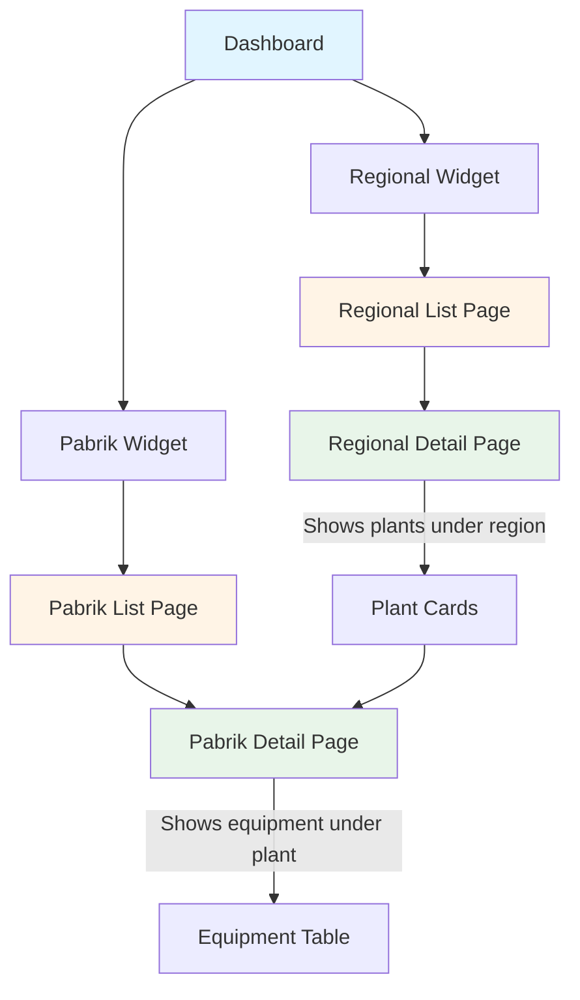
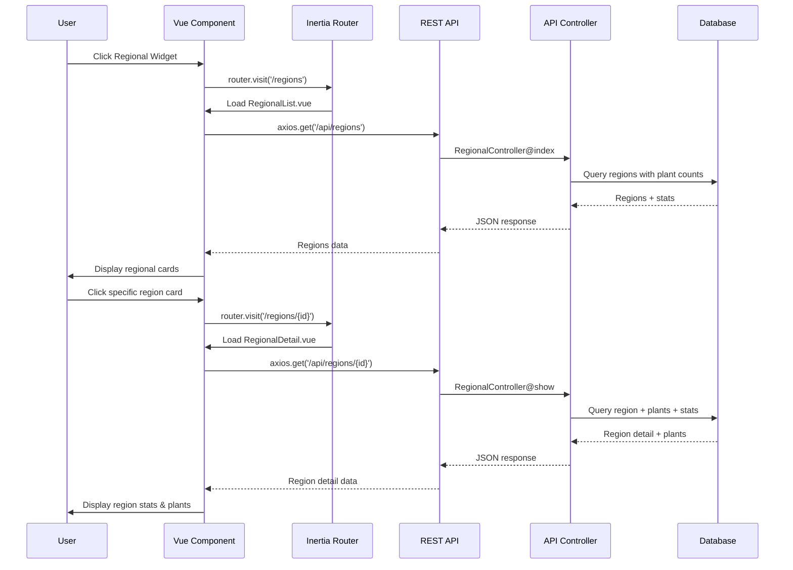
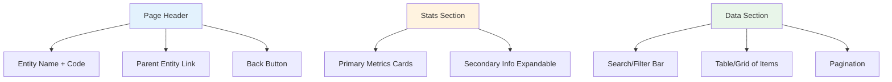

# Regional and Pabrik (Plant) Dashboard Navigation Feature

## Overview

This feature extends the existing CMMS dashboard to provide hierarchical navigation from aggregate statistics into detailed regional and plant (pabrik) views. Users can drill down from high-level widget cards on the main dashboard into dedicated list pages showing all regions or all plants, and then further navigate to detail pages displaying entity-specific statistics and related data.

### Business Value

- Enable stakeholders to navigate from summary metrics to detailed operational data through intuitive drill-down
- Provide regional managers with consolidated views of all plants under their jurisdiction
- Allow plant managers to access equipment inventories and performance metrics for individual facilities
- Support organizational hierarchy (Region → Plant → Equipment) through a consistent navigation pattern

### User Journey



## Architecture

### Component Hierarchy

The feature introduces four new page components following the existing Vue 3 + Inertia.js architecture:

| Page Component | Route | Purpose |
|---------------|-------|---------|
| `RegionalList.vue` | `/regions` | Display all regions as cards with summary statistics |
| `RegionalDetail.vue` | `/regions/{id}` | Show detailed stats for a region and list of plants within that region |
| `PabrikList.vue` | `/pabrik` | Display all plants as cards with summary statistics |
| `PabrikDetail.vue` | `/pabrik/{id}` | Show detailed stats for a plant and equipment table for that plant |

### Data Flow Architecture



**Key Separation of Concerns**:

1. **Inertia Routes** (`/regions`, `/pabrik/{id}`) - Used for page navigation, render Vue components
2. **API Routes** (`/api/regions`, `/api/pabrik/{id}`) - Used for data fetching via axios
3. **Wayfinder** - Generates TypeScript helpers for Inertia navigation only
4. **Controllers** - API controllers handle data retrieval and transformation

## Page Specifications

### Component Structure and Imports

**Required Component Imports** (consistent across all detail pages):

From shadcn-vue components:
- Button (`@/components/ui/button`)
- Card, CardContent, CardHeader, CardTitle (`@/components/ui/card`)
- Skeleton (`@/components/ui/skeleton`)
- Badge (`@/components/ui/badge`)
- Empty, EmptyDescription, EmptyHeader, EmptyMedia, EmptyTitle (`@/components/ui/empty`)

From Lucide icons:
- ArrowLeft, Factory, Globe2, Wrench, Building2, FileText, CheckCircle2, Activity, Gauge, ClipboardCheck, MapPin

From Vue:
- ref, computed, watch, onMounted (from 'vue')

From Inertia:
- router (from '@inertiajs/vue3')

**Component State Pattern** (following EquipmentContent.vue):

```
Local component state using ref:
- loading: ref(false) - Controls skeleton display
- notFound: ref(false) - Controls not found state (for detail pages)
- data: ref(null) - Stores fetched data
- error: ref(null) - Stores error messages

Computed properties:
- Display formatters (e.g., formatDate, formatNumber)
- Conditional text (e.g., back button text)
- Data transformations
```

**Lifecycle Pattern**:

```
Component mount sequence:
1. onMounted() hook triggers
2. Set loading.value = true
3. Make axios API call
4. On success:
   - Store data in ref
   - Set loading.value = false
5. On error:
   - Set notFound.value = true (if 404)
   - Set error.value with message
   - Set loading.value = false
```

**Template Structure Pattern** (all detail pages):

```
Root container (space-y-6 for vertical spacing):
  
  <!-- Loading State -->
  <div v-if="loading" class="space-y-6">
    [Skeleton components matching final layout]
  </div>
  
  <!-- Not Found State (optional for detail pages) -->
  <div v-else-if="notFound" class="flex min-h-[calc(100vh-15rem)] items-center justify-center">
    [Not found message with icon]
  </div>
  
  <!-- Main Content -->
  <template v-else>
    <!-- Header Section -->
    <div class="flex flex-col gap-5 lg:flex-row lg:items-start lg:justify-between">
      [Title, details, back button]
    </div>
    
    <!-- Stats Cards Section -->
    <div class="grid grid-cols-2 gap-4 lg:grid-cols-4">
      [Stat cards]
    </div>
    
    <!-- Data Section -->
    <Card>
      <CardHeader>
        <CardTitle>[Title with icon]</CardTitle>
      </CardHeader>
      <CardContent>
        [Table or card list]
      </CardContent>
    </Card>
  </template>
```

### 1. Regional List Page

**Route**: `/regions`  
**Access**: Authenticated users  
**Layout**: AppLayout with breadcrumbs

#### Display Structure

**Mobile-First Layout**:
- Page header with title "Regional" and optional filters
- Back button in the header (full-width below title on mobile, top-right on desktop)
- Grid layout of regional cards:
  - **Mobile (default)**: Single column, full-width cards
  - **Tablet (≥768px)**: 2-column grid
  - **Desktop (≥1024px)**: 3-column grid
- Each card displays:
  - Region name
  - Region category
  - Region number
  - Plant count under this region
  - Optional: Icon or color coding by category

**Back Button Behavior**:
- Returns user to Dashboard (`/dashboard`)
- **Mobile**: Full-width button below page title
- **Desktop (≥768px)**: Inline in page header alongside filter controls
- Uses Inertia router.visit() for navigation
- Styled as outline button with left arrow icon (consistent with equipment detail page)

#### Data Requirements

| Field | Source | Description |
|-------|--------|-------------|
| id | regions.id | Unique regional identifier |
| name | regions.name | Regional name |
| category | regions.category | Category (palmco, supporting_co) |
| no | regions.no | Regional number |
| plants_count | COUNT(plants) | Number of plants in this region |

#### Interaction Behavior

- Clicking any regional card navigates to `/regions/{id}` detail page
- Cards should have hover states to indicate clickability (touch-friendly tap targets on mobile)
- Loading states: Display skeleton loader components (card-shaped) while fetching data from API
- Empty state message if no regions exist
- **Mobile-First Interactions**:
  - Minimum touch target size: 44x44px for all clickable elements
  - Card padding optimized for thumb navigation
  - No hover-dependent functionality

### 2. Regional Detail Page

**Route**: `/regions/{id}`  
**Access**: Authenticated users  
**Layout**: AppLayout with breadcrumbs (Dashboard > Regional > {Region Name})

#### Display Structure

**Layout Pattern** (following EquipmentContent.vue design):

The page uses a vertical layout with clear section separation using the `space-y-6` spacing pattern.

**Header Section** (flex layout with responsive behavior):
- Container: `flex flex-col gap-5 lg:flex-row lg:items-start lg:justify-between`
- **Left side** (main content):
  - Region name as title: `text-3xl font-bold tracking-tight`
  - Region category/number as subtitle: `text-muted-foreground`
  - Equipment Details Grid below title
- **Right side** (actions):
  - Back button: `variant="outline"` with ArrowLeft icon
  - **Mobile**: Stacked in `flex-wrap gap-3 md:flex-nowrap`
  - **Desktop**: Inline, `w-full md:w-auto`

**Regional Details Grid** (similar to equipment details grid):
- Container: `mt-4 grid grid-cols-2 gap-4 lg:grid-cols-4`
- Each detail item structure:
  ```
  <div class="space-y-1">
    <p class="text-xs font-medium text-muted-foreground">Label</p>
    <p class="text-sm font-semibold">Value or N/A</p>
  </div>
  ```
- Display items:
  - Category (palmco, supporting_co)
  - Regional Number
  - Total Plants
  - Active Plants

**Statistics Cards Section**:
- Separate Card components for each metric (not embedded in header)
- Grid layout: `grid grid-cols-2 gap-4 lg:grid-cols-4`
- Each stat uses Card, CardHeader, CardTitle, CardContent structure
- Icon in CardHeader with title
- Large metric value in CardContent

**Plants Data Section**:
- Wrapped in Card component
- CardHeader with title and icon (Factory icon)
- CardContent contains the table/card list
- **Mobile**: Card-based layout for each plant
- **Desktop (≥768px)**: Table layout with columns

**Back Button Behavior**:
- Returns user to Regional List page (`/regions`)
- Positioned in page header next to title
- Uses Inertia router.visit() or router.back()
- Styled as outline button with ArrowLeft icon and "Back to Regional" text

#### Data Requirements

**Regional Information**:

| Field | Source | Description |
|-------|--------|-------------|
| id | regions.id | Regional ID |
| name | regions.name | Regional name |
| category | regions.category | Category classification |
| no | regions.no | Regional number |

**Regional Statistics**:

| Metric | Calculation | Description | Display Format |
|--------|-------------|-------------|----------------|
| total_plants | COUNT(plants WHERE regional_id = {id}) | Number of plants in region | Integer with locale formatting |
| total_equipment | COUNT(equipment JOIN plants WHERE regional_id = {id}) | Equipment across all plants | Integer with locale formatting |
| total_work_orders | COUNT(work_orders JOIN plants WHERE regional_id = {id}) | All work orders in region | Integer with locale formatting |
| active_plants | COUNT(plants WHERE regional_id = {id} AND is_active = true) | Active plants only | Integer |

**Stats Display Pattern** (following EquipmentContent.vue pattern):
- Separate section with Card grid layout
- Grid container: `grid grid-cols-2 gap-4 lg:grid-cols-4`
- Each stat card structure:
  ```
  Card:
    CardHeader (flex items-center gap-2):
      Icon (h-5 w-5)
      CardTitle: Metric name
    CardContent:
      Large value (text-2xl font-bold)
      Optional description (text-xs text-muted-foreground)
  ```
- Stats to display:
  - Total plants in region (Factory icon)
  - Total equipment across plants (Wrench icon)
  - Total work orders (FileText icon)
  - Active plants (CheckCircle2 icon)

**Plants Data Card** (following table card pattern from EquipmentContent.vue):
- Wrapped in Card component with CardHeader and CardContent
- CardHeader structure:
  ```
  CardHeader:
    CardTitle (flex items-center gap-2):
      Factory icon (h-5 w-5)
      "Plants in This Region"
  ```
- CardContent:
  - Contains table (desktop) or card list (mobile)
  - Table wrapped in responsive container
  - Empty state uses Empty component when no plants

#### Interaction Behavior

- Clicking a plant card/row navigates to `/pabrik/{plant_id}`
- Breadcrumb navigation allows return to regional list or dashboard
- Sort and filter controls:
  - **Mobile**: Bottom sheet or dropdown filters
  - **Desktop**: Inline filter bar above table
- Loading state: Display skeleton loaders for stats cards and table rows during data fetch

### 3. Pabrik (Plant) List Page

**Route**: `/pabrik`  
**Access**: Authenticated users  
**Layout**: AppLayout with breadcrumbs

#### Display Structure

**Mobile-First Layout**:
- Page header with title "Pabrik" and optional filters
- Back button in the header:
  - **Mobile**: Full-width below title
  - **Desktop (≥768px)**: Top-right inline
- Grid layout of plant cards:
  - **Mobile (default)**: Single column, full-width cards
  - **Tablet (≥768px)**: 2-column grid
  - **Desktop (≥1024px)**: 3-column grid
- Each card displays:
  - Plant name
  - Plant code
  - Regional affiliation (name)
  - Equipment count
  - Active status indicator
  - Optional: Installed capacity (kaps_terpasang)

**Back Button Behavior**:
- Returns user to Dashboard (`/dashboard`)
- **Mobile**: Full-width button below page title
- **Desktop (≥768px)**: Positioned in page header (top-right)
- Uses Inertia router.visit() for navigation
- Styled as outline button with left arrow icon

#### Data Requirements

| Field | Source | Description |
|-------|--------|-------------|
| id | plants.id | Plant identifier |
| name | plants.name | Plant name |
| plant_code | plants.plant_code | Unique plant code |
| regional_name | regions.name (via regional_id) | Name of parent region |
| equipment_count | COUNT(equipment WHERE plant_id = plants.id) | Equipment count |
| is_active | plants.is_active | Active/inactive status |
| kaps_terpasang | plants.kaps_terpasang | Installed capacity |

#### Interaction Behavior

- Clicking any plant card navigates to `/pabrik/{id}` detail page
- Filter options:
  - **Mobile**: Expandable filter panel or bottom sheet
  - **Desktop**: Inline filter bar with dropdowns
  - By region (dropdown or multi-select)
  - Active/inactive status
  - Search by plant name or code
- Cards have hover states to indicate clickability (touch-optimized tap targets on mobile)
- Loading state: Display skeleton loader components (card-shaped) while fetching data from API
- **Mobile-First Interactions**:
  - Minimum touch target size: 44x44px
  - Swipe-friendly card spacing
  - Touch-optimized filter controls

### 4. Pabrik (Plant) Detail Page

**Route**: `/pabrik/{id}`  
**Access**: Authenticated users  
**Layout**: AppLayout with breadcrumbs (Dashboard > Pabrik > {Plant Name})

#### Display Structure

**Layout Pattern** (following EquipmentContent.vue design):

The page uses a vertical layout with `space-y-6` spacing between major sections.

**Header Section** (flex layout with responsive behavior):
- Container: `flex flex-col gap-5 lg:flex-row lg:items-start lg:justify-between`
- **Left side** (main content area):
  - Plant name as title: `text-3xl font-bold tracking-tight`
  - Plant code as subtitle: `text-muted-foreground` with # prefix
  - Parent regional link: `text-xs text-muted-foreground` (clickable)
  - Plant Details Grid below subtitle
- **Right side** (actions area):
  - Back button: `variant="outline"` with ArrowLeft icon
  - **Mobile**: Full width (`w-full md:w-auto`)
  - **Desktop**: Auto width, inline in flex container

**Plant Details Grid** (similar to equipment details grid pattern):
- Container: `mt-4 grid grid-cols-2 gap-4 lg:grid-cols-4`
- Each detail item:
  ```
  <div class="space-y-1">
    <p class="text-xs font-medium text-muted-foreground">Label</p>
    <p class="text-sm font-semibold">Value or N/A</p>
  </div>
  ```
- Display items:
  - Year/Established (if available)
  - Installed Capacity (kaps_terpasang)
  - Unit count
  - Active status (with Badge component)
  - Bunch Press Installation (boolean badge)
  - Cofiring capability (boolean badge)

**Statistics Cards Section**:
- Grid of metric cards: `grid grid-cols-2 gap-4 lg:grid-cols-4 xl:grid-cols-6`
- Each stat uses Card, CardHeader, CardTitle, CardContent structure
- CardHeader contains icon and metric name
- CardContent contains large value and optional description
- Stats displayed:
  - Total equipment (Wrench icon)
  - Total stations (Building2 icon)
  - Total work orders (FileText icon)
  - Active work orders (ClipboardCheck icon)
  - Installed capacity (Gauge icon)
  - Equipment utilization (Activity icon, if applicable)

**Equipment Data Section**:
- Wrapped in Card component
- CardHeader with title "Equipment List" and icon (Wrench)
- CardContent contains table (desktop) or card list (mobile)
- Pagination controls at bottom of card

**Back Button Behavior**:
- **Context-aware navigation**:
  - If user came from Pabrik List: Returns to `/pabrik`
  - If user came from Regional Detail: Returns to `/regions/{regional_id}`
  - Default: Uses browser history back (router.back())
- Button text adapts:
  - "Back to Pabrik" or "Back to Regional" based on referrer
- Positioned in page header next to title
- Styled as outline button with ArrowLeft icon

#### Data Requirements

**Plant Information**:

| Field | Source | Description |
|-------|--------|-------------|
| id | plants.id | Plant ID |
| name | plants.name | Plant name |
| plant_code | plants.plant_code | Plant code |
| regional_id | plants.regional_id | Parent region ID |
| regional_name | regions.name | Parent region name |
| is_active | plants.is_active | Active status |
| kaps_terpasang | plants.kaps_terpasang | Installed capacity |
| unit | plants.unit | Unit count |

**Plant Statistics**:

| Metric | Calculation | Description | Display Format |
|--------|-------------|-------------|----------------|
| total_equipment | COUNT(equipment WHERE plant_id = {id}) | Equipment count | Integer with locale formatting |
| total_stations | COUNT(stations WHERE plant_id = {id}) | Station count | Integer with locale formatting |
| total_work_orders | COUNT(work_orders WHERE plant_id = {id}) | Work order count | Integer with locale formatting |
| active_work_orders | COUNT(work_orders WHERE plant_id = {id} AND status = active) | Active WO count | Integer with locale formatting |
| equipment_utilization | (active_equipment / total_equipment) * 100 | Percentage of active equipment | Percentage (e.g., "85.5%") |
| latest_sync | MAX(running_times.updated_at) | Last data sync timestamp | Relative time (e.g., "2 hours ago") |

**Additional Plant Details** (displayed in header or info section):

| Field | Source | Description | Display Location |
|-------|--------|-------------|------------------|
| plant_code | plants.plant_code | Unique plant identifier | Subtitle under plant name |
| regional_name | regions.name | Parent region (clickable link) | Breadcrumb and header |
| kaps_terpasang | plants.kaps_terpasang | Installed capacity | Stat card |
| unit | plants.unit | Number of processing units | Info section |
| is_active | plants.is_active | Active status | Badge (green/gray) |
| instalasi_bunch_press | plants.instalasi_bunch_press | Bunch press installation | Info section (boolean badge) |
| cofiring | plants.cofiring | Cofiring capability | Info section (boolean badge) |

**Stats Display Pattern**:
- Primary stats in 4-column grid (responsive: 2x2 on mobile)
- Each card shows icon, value, and label
- Additional details in collapsible "Plant Information" section
- Regional link styled as clickable badge or breadcrumb item

**Equipment List** (paginated):

| Field | Source | Description |
|-------|--------|-------------|
| uuid | equipment.uuid | Unique identifier |
| equipment_number | equipment.equipment_number | Equipment number |
| equipment_description | equipment.equipment_description | Description |
| station_description | stations.description | Station description |
| eqtyp | equipment.eqtyp | Equipment type code |
| equipment_type | Computed attribute | Human-readable type |
| latest_running_hours | MAX(running_times.counter_reading) | Latest counter reading |

#### Interaction Behavior

- Clicking an equipment row/card navigates to `/equipment/{uuid}` (existing page)
- Pagination controls:
  - **Mobile**: Simplified prev/next buttons, page info
  - **Desktop**: Full pagination with page numbers and per-page selector (10, 25, 50)
- Search by equipment number or description:
  - **Mobile**: Full-width search input with clear button
  - **Desktop**: Inline search in toolbar
- Sort controls:
  - **Mobile**: Bottom sheet or dropdown sort menu
  - **Desktop**: Clickable column headers
- Link to parent regional detail page via breadcrumb or regional name

## API Endpoint Specifications

**Backend Implementation Pattern**:

- API Controllers located in `app/Http/Controllers/Api/`
- Controller naming: `RegionalApiController.php`, `PabrikApiController.php`
- Each controller handles data retrieval, transformation, and JSON response
- Routes registered in `routes/api.php`
- All API endpoints return JSON (no Inertia responses)

**Frontend Data Fetching Pattern**:

- Vue components use axios for API calls
- Data fetched in `onMounted()` lifecycle hook or on user interaction
- Loading states managed with local `ref` variables
- Error handling with try/catch blocks

### Regional Endpoints

#### GET `/api/regions`

**Purpose**: Retrieve all regions with plant counts

**Backend Controller**: `RegionalApiController@index`

**Response Schema**:

| Field | Type | Description |
|-------|------|-------------|
| data | Array | List of regions |
| data[].id | Integer | Region ID |
| data[].name | String | Region name |
| data[].category | String | Category |
| data[].no | Integer | Region number |
| data[].plants_count | Integer | Count of plants in region |

**Example Response**:
```
{
  "data": [
    {
      "id": 1,
      "name": "Regional I Eks N3, DSMTU, N8",
      "category": "palmco",
      "no": 1,
      "plants_count": 12
    }
  ]
}
```

#### GET `/api/regions/{id}`

**Purpose**: Retrieve detailed regional data with plants and statistics

**Backend Controller**: `RegionalApiController@show`

**Response Schema**:

| Field | Type | Description |
|-------|------|-------------|
| region | Object | Regional information |
| region.id | Integer | Region ID |
| region.name | String | Region name |
| region.category | String | Category |
| region.no | Integer | Region number |
| stats | Object | Regional statistics |
| stats.total_plants | Integer | Plant count |
| stats.total_equipment | Integer | Total equipment across plants |
| stats.total_work_orders | Integer | Total work orders |
| plants | Array | List of plants in region |
| plants[].id | Integer | Plant ID |
| plants[].name | String | Plant name |
| plants[].plant_code | String | Plant code |
| plants[].is_active | Boolean | Active status |
| plants[].equipment_count | Integer | Equipment count for plant |

**Example Response**:
```
{
  "region": {
    "id": 1,
    "name": "Regional I Eks N3, DSMTU, N8",
    "category": "palmco",
    "no": 1
  },
  "stats": {
    "total_plants": 12,
    "total_equipment": 450,
    "total_work_orders": 89
  },
  "plants": [
    {
      "id": 5,
      "name": "PKS Adolina",
      "plant_code": "ADO",
      "is_active": true,
      "equipment_count": 38
    }
  ]
}
```

### Plant (Pabrik) Endpoints

#### GET `/api/pabrik`

**Purpose**: Retrieve all plants with regional and equipment information

**Backend Controller**: `PabrikApiController@index`

**Query Parameters**:

| Parameter | Type | Optional | Description |
|-----------|------|----------|-------------|
| regional_id | Integer | Yes | Filter by region |
| is_active | Boolean | Yes | Filter by active status |
| search | String | Yes | Search plant name or code |

**Response Schema**:

| Field | Type | Description |
|-------|------|-------------|
| data | Array | List of plants |
| data[].id | Integer | Plant ID |
| data[].name | String | Plant name |
| data[].plant_code | String | Plant code |
| data[].regional_id | Integer | Parent region ID |
| data[].regional_name | String | Parent region name |
| data[].is_active | Boolean | Active status |
| data[].equipment_count | Integer | Equipment count |
| data[].kaps_terpasang | Integer | Installed capacity |

**Example Response**:
```
{
  "data": [
    {
      "id": 5,
      "name": "PKS Adolina",
      "plant_code": "ADO",
      "regional_id": 1,
      "regional_name": "Regional I Eks N3, DSMTU, N8",
      "is_active": true,
      "equipment_count": 38,
      "kaps_terpasang": 60000
    }
  ]
}
```

#### GET `/api/pabrik/{id}`

**Purpose**: Retrieve detailed plant data with equipment list and statistics

**Backend Controller**: `PabrikApiController@show`

**Query Parameters**:

| Parameter | Type | Optional | Description |
|-----------|------|----------|-------------|
| per_page | Integer | Yes | Items per page (default: 25) |
| page | Integer | Yes | Page number |
| search | String | Yes | Search equipment |
| sort_by | String | Yes | Sort column |
| sort_direction | String | Yes | asc or desc |

**Response Schema**:

| Field | Type | Description |
|-------|------|-------------|
| plant | Object | Plant information |
| plant.id | Integer | Plant ID |
| plant.name | String | Plant name |
| plant.plant_code | String | Plant code |
| plant.regional_id | Integer | Parent region ID |
| plant.regional_name | String | Parent region name |
| plant.is_active | Boolean | Active status |
| plant.kaps_terpasang | Integer | Installed capacity |
| plant.unit | Integer | Unit count |
| stats | Object | Plant statistics |
| stats.total_equipment | Integer | Equipment count |
| stats.total_stations | Integer | Station count |
| stats.total_work_orders | Integer | Work order count |
| stats.active_work_orders | Integer | Active work orders |
| equipment | Object | Paginated equipment list |
| equipment.data | Array | Equipment records |
| equipment.total | Integer | Total equipment count |
| equipment.per_page | Integer | Items per page |
| equipment.current_page | Integer | Current page |
| equipment.last_page | Integer | Last page number |

**Equipment Record Schema**:

| Field | Type | Description |
|-------|------|-------------|
| uuid | String | Equipment UUID |
| equipment_number | String | Equipment number |
| equipment_description | String | Description |
| station_description | String | Station description |
| eqtyp | String | Equipment type code |
| equipment_type | String | Human-readable type |
| latest_running_hours | Decimal | Latest counter reading |

**Example Response**:
```
{
  "plant": {
    "id": 5,
    "name": "PKS Adolina",
    "plant_code": "ADO",
    "regional_id": 1,
    "regional_name": "Regional I Eks N3, DSMTU, N8",
    "is_active": true,
    "kaps_terpasang": 60000,
    "unit": 2
  },
  "stats": {
    "total_equipment": 38,
    "total_stations": 8,
    "total_work_orders": 15,
    "active_work_orders": 3
  },
  "equipment": {
    "data": [
      {
        "uuid": "abc-123",
        "equipment_number": "EQ-001",
        "equipment_description": "Boiler Main",
        "station_description": "Boiler Station",
        "eqtyp": "1",
        "equipment_type": "Mesin Produksi",
        "latest_running_hours": 12450.5
      }
    ],
    "total": 38,
    "per_page": 25,
    "current_page": 1,
    "last_page": 2
  }
}
```

## Navigation Flow Integration

### Dashboard Widget Modifications

The existing Dashboard page contains four stat widgets. Two of them need clickable behavior:

| Widget | Current State | New Behavior |
|--------|--------------|--------------|
| Total Region | Static display | Becomes clickable, navigates to `/regions` |
| Total Factory | Static display | Becomes clickable, navigates to `/pabrik` |
| Total Equipment | Static display | No change (already has drill-down via monitoring page) |
| Total Material | Static display | No change |

**Implementation Approach**:
- Wrap the Regional and Pabrik cards in clickable containers (Card component with cursor-pointer styling)
- Add hover states to indicate interactivity
- Use Inertia.js `router.visit('/regions')` for navigation to list pages
- Alternatively, use Wayfinder-generated route helpers: `router.visit(regions().url)`

**Navigation vs Data Fetching**:
- **Navigation**: Uses Inertia routes (`/regions`, `/pabrik/{id}`) with Wayfinder helpers
- **Data Fetching**: Uses API routes (`/api/regions`, `/api/pabrik/{id}`) with axios
- These are separate concerns handled by different route groups

### Breadcrumb Strategy

Each page must display breadcrumbs for navigation context. Breadcrumbs are clickable and allow users to navigate back through the hierarchy.

**Breadcrumb Paths**:

| Page | Breadcrumb Path | Back Button Destination |
|------|----------------|------------------------|
| Dashboard | Dashboard | N/A |
| Regional List | Dashboard > Regional | Dashboard |
| Regional Detail | Dashboard > Regional > {Region Name} | Regional List |
| Pabrik List | Dashboard > Pabrik | Dashboard |
| Pabrik Detail (from Pabrik List) | Dashboard > Pabrik > {Plant Name} | Pabrik List |
| Pabrik Detail (from Regional Detail) | Dashboard > Regional > {Region Name} > {Plant Name} | Regional Detail ({Region Name}) |
| Equipment Detail (from Pabrik Detail) | Dashboard > Pabrik > {Plant Name} > Equipment > {Eq. Number} | Pabrik Detail ({Plant Name}) |

**Implementation Notes**:

1. **Breadcrumb Component Usage**:
   - Use AppLayout's breadcrumbs prop (same pattern as equipment detail page)
   - Each breadcrumb item is an object with `title` and `href` properties
   - Final breadcrumb (current page) has `href: '#'` and is non-clickable

2. **Context-Aware Navigation**:
   - Plant detail page must detect entry point (referrer) to build correct breadcrumb
   - Options for implementation:
     - Pass referrer context via Inertia props when navigating from regional detail
     - Use query parameter: `/pabrik/{id}?from=regional&regional_id={id}`
     - Store navigation history in session/localStorage
   - Recommended: Use Inertia props for cleaner URL structure

3. **Back Button Text Adaptation**:
   - Regional List: "Back to Dashboard"
   - Regional Detail: "Back to Regional"
   - Pabrik List: "Back to Dashboard"
   - Pabrik Detail:
     - If from Pabrik List: "Back to Pabrik"
     - If from Regional Detail: "Back to {Region Name}" or "Back to Regional"

4. **Equipment Detail Page Integration**:
   - When navigating from plant detail to equipment detail, pass plant context
   - Equipment detail page breadcrumb should include plant information when available
   - Back button should return to plant detail page (not monitoring page) when accessed from plant context

### Route Definitions

**Frontend Routes** (registered in `routes/web.php`):

| Route Name | Path | Render Component | Middleware |
|-----------|------|------------------|------------|
| regions.index | /regions | RegionalList.vue | auth |
| regions.show | /regions/{id} | RegionalDetail.vue | auth |
| pabrik.index | /pabrik | PabrikList.vue | auth |
| pabrik.show | /pabrik/{id} | PabrikDetail.vue | auth |

These routes use Inertia.js to render Vue pages. Laravel Wayfinder will auto-generate TypeScript route helpers for navigation:
- `regions()` → list page route object
- `regions.show({ id })` → detail page route object
- `pabrik()` → list page route object
- `pabrik.show({ id })` → detail page route object

Wayfinder helpers are used **only for page navigation** via Inertia Link components or router.visit().

**API Routes** (registered in `routes/api.php`):

Separate RESTful API endpoints for data fetching via axios:

| Endpoint | Method | Purpose | Returns |
|----------|--------|---------|----------|
| /api/regions | GET | List all regions with plant counts | JSON array |
| /api/regions/{id} | GET | Get region detail with plants and stats | JSON object |
| /api/pabrik | GET | List all plants with filters | JSON array |
| /api/pabrik/{id} | GET | Get plant detail with equipment list | JSON object |

**Data Fetching Strategy**:

Pages use traditional axios HTTP calls to fetch data from API endpoints:

```javascript
// In RegionalList.vue
const { data } = await axios.get('/api/regions')

// In PabrikDetail.vue  
const { data } = await axios.get(`/api/pabrik/${id}`, {
  params: { per_page: 25, page: 1 }
})
```

This approach:
- Keeps Wayfinder for route generation and page navigation only
- Uses standard REST API patterns for data fetching
- Maintains consistency with existing pages (Dashboard.vue, Monitoring.vue)
- Allows API endpoints to be used by other clients if needed

## UI/UX Considerations

### Back Button Pattern

Following the equipment detail page pattern, all list and detail pages must include a back button:

**Visual Specifications** (Mobile-First):
- Button variant: `outline`
- Icon: `ArrowLeft` from Lucide (positioned before text with `mr-2`)
- Text: Context-aware (e.g., "Back to Dashboard", "Back to Regional")
- **Mobile-First Placement**:
  - Default (mobile): Full-width button below page title (`w-full mb-4`)
  - Tablet (md: ≥768px): Auto-width, positioned in header (`md:w-auto md:mb-0`)
  - Desktop: Inline with header actions, top-right alignment
- Touch-optimized: Minimum 44px height on mobile

**Interaction Behavior**:
- Click triggers Inertia navigation: `router.visit(destination)` or `router.back()`
- Keyboard accessible (Tab navigation)
- Hover state shows pointer cursor
- Maintains browser history for proper back/forward navigation

**Implementation Pattern**:
```javascript
const goBack = () => {
  // Context-aware navigation
  router.visit(referrerRoute)
}
```

Emit pattern (if using child components):
```javascript
// Parent component
@go-back="goBack"

// Child component
<Button @click="$emit('goBack')">
  <ArrowLeft class="mr-2 h-4 w-4" />
  Back to [Context]
</Button>
```

### Responsive Design - Mobile-First Approach

**Core Principle**: Design and develop for mobile screens first, then progressively enhance for larger screens.

**Breakpoint Strategy** (using Tailwind CSS default breakpoints):

| Breakpoint | Screen Width | Device Target | Layout Approach |
|------------|--------------|---------------|------------------|
| Default (no prefix) | < 640px | Mobile phones | Base styles, single column, full-width elements |
| `sm:` | ≥ 640px | Large phones | Minor adjustments, still mobile-optimized |
| `md:` | ≥ 768px | Tablets | 2-column grids, inline controls |
| `lg:` | ≥ 1024px | Desktops | 3-column grids, full table layouts |
| `xl:` | ≥ 1280px | Large desktops | Maximum width containers, optimized spacing |

**Mobile-First Implementation Guidelines**:

1. **Base Styles (Mobile Default)**:
   - Single column layouts (`flex flex-col` or `grid grid-cols-1`)
   - Full-width cards and buttons
   - Vertical stacking of all content
   - Touch-optimized spacing (minimum 44x44px tap targets)
   - Simplified navigation (hamburger menus, bottom sheets)
   - Card-based data display (not tables)

2. **Progressive Enhancement for Tablets (md: ≥768px)**:
   - 2-column card grids (`md:grid-cols-2`)
   - Stats in 2x2 grid layout
   - Inline filter bars replace mobile bottom sheets
   - Side-by-side button groups
   - Table layouts start to appear (with careful column selection)
   - Horizontal scroll for wide tables

3. **Desktop Optimization (lg: ≥1024px)**:
   - 3-column card grids (`lg:grid-cols-3`)
   - Stats in single row (`lg:grid-cols-4` or `lg:grid-cols-6`)
   - Full-width tables with all columns visible
   - Multi-column forms and layouts
   - Hover states become prominent
   - Mouse-optimized interactions

**Component-Specific Mobile-First Patterns**:

- **Cards**: 
  - Mobile: `w-full p-4`
  - Desktop: `md:w-auto md:p-6`
  
- **Stats Grid**:
  - Mobile: `grid grid-cols-2 gap-4`
  - Desktop: `lg:grid-cols-4 lg:gap-6`
  
- **Buttons**:
  - Mobile: `w-full` (full-width)
  - Desktop: `md:w-auto` (auto-width)
  
- **Data Tables**:
  - Mobile: Use card layout instead (`<div>` based)
  - Desktop: `md:table` (switch to table element)
  
- **Filters**:
  - Mobile: `<Sheet>` component (bottom drawer)
  - Desktop: `md:inline-flex` (inline filter bar)

**Touch vs Mouse Interactions**:

| Feature | Mobile (Touch) | Desktop (Mouse) |
|---------|----------------|------------------|
| Minimum target size | 44x44px | 32x32px acceptable |
| Hover states | None (not reliable) | Visual feedback required |
| Click/tap feedback | Active/pressed states | Hover + active states |
| Navigation | Bottom nav, hamburger | Top nav, sidebar |
| Tooltips | Avoid (require long-press) | Encouraged |
| Gestures | Swipe, pinch, long-press | Scroll, click, drag |

**Performance Considerations for Mobile**:

- Load critical content first (above-the-fold)
- Lazy load images and heavy components
- Reduce animation complexity on mobile
- Optimize bundle size (mobile network constraints)
- Use skeleton loaders to improve perceived performance
- Implement pagination with smaller page sizes on mobile (10 items vs 25 on desktop)

### Consistency with Existing Design

Follow the established design patterns using **semantic CSS classes and design tokens**:

**Color System - MUST Use Semantic Classes**:

The application uses a theme-based color system with CSS custom properties. **Always use semantic color classes, never hardcoded Tailwind colors**.

| Semantic Class | Usage | Example |
|---------------|-------|----------|
| `bg-background` | Page background | Main page wrapper |
| `bg-card` | Card backgrounds | Stat cards, data cards |
| `bg-muted` | Subtle backgrounds | Secondary sections |
| `bg-accent` | Highlight backgrounds | Hover states, badges |
| `bg-primary` | Primary action backgrounds | CTA buttons |
| `text-foreground` | Primary text | Body text, headings |
| `text-muted-foreground` | Secondary text | Descriptions, labels |
| `text-card-foreground` | Text on cards | Card content text |
| `text-primary` | Primary color text | Links, emphasis |
| `text-accent-foreground` | Accent text | Special labels |
| `border-border` | Standard borders | Card borders, dividers |
| `border-input` | Input borders | Form fields |
| `border-primary` | Primary borders | Focused states |

**Component Styling - Use shadcn-vue Components**:
- Card, CardHeader, CardContent, CardTitle from `@/components/ui/card`
- Button variants: `default`, `outline`, `ghost`, `secondary`
- Badge variants: `default`, `secondary`, `outline`, `destructive`
- Use Lucide icons: Factory, Globe2, Wrench, Building2, MapPin, Activity

**Typography - Use Semantic Classes**:
- Headings: `text-3xl font-bold tracking-tight` (not `text-gray-900`)
- Subtitles: `text-muted-foreground` (not `text-gray-600`)
- Labels: `text-xs font-medium text-muted-foreground` (not `text-gray-500`)
- Values: `text-2xl font-bold` (inherits foreground color)

**State Styling**:
- Loading: Skeleton components with `bg-muted` animation
- Empty states: `text-muted-foreground` for messages
- Hover: `hover:bg-accent hover:text-accent-foreground`
- Active: `bg-accent text-accent-foreground`
- Focus: `ring-ring` and `ring-offset-background`

**Stat Card Component Pattern**:

Each statistics card follows this structure with **semantic color classes**:
- CardHeader: Contains title and icon
- CardContent: Contains the metric value and description
- Responsive grid layout: 2 columns mobile, 4 columns desktop
- Consistent spacing and typography

Structure description (styling notes):
```
Card component (bg-card, border-border):
  CardHeader (flex, items-center, justify-between):
    - CardTitle: text-sm font-medium (inherits card-foreground)
    - Icon: h-4 w-4 text-muted-foreground
  
  CardContent:
    - Value: text-2xl font-bold (inherits foreground color)
    - Description: text-xs text-muted-foreground
```

**Clickable Card States**:
- Default: `bg-card border-border`
- Hover: `hover:bg-accent hover:border-accent-foreground/20 transition-colors`
- Cursor: `cursor-pointer`
- Focus: `focus-visible:ring-2 focus-visible:ring-ring focus-visible:ring-offset-2`

**Detail Information Display**:

For regional and plant detail pages, information is organized in sections using **semantic color classes**:

1. **Page Header Section**:
   - Main title (entity name): `text-3xl font-bold tracking-tight` (inherits foreground)
   - Subtitle (code or category): `text-muted-foreground`
   - Parent entity link: Badge with `variant="outline"` or breadcrumb style
   - Back button: `variant="outline"` with ArrowLeft icon

2. **Statistics Section**:
   - Grid of metric cards using Card component (auto `bg-card`)
   - Responsive: 2x2 grid mobile, 1x4 row desktop
   - Loading state: Skeleton with `bg-muted` class
   - Empty state: `text-muted-foreground` message

3. **Data Table/Grid Section**:
   - Table wrapper: `bg-card` with `border-border`
   - Table header: `bg-muted` with `text-muted-foreground`
   - Table rows: Hover state `hover:bg-accent/50`
   - Alternating rows (optional): Even rows with `bg-muted/30`
   - Pagination: Button components with semantic variants
   - **Empty state in table**: Use Empty component when no data
     - For tables with no rows, render Empty component instead of empty tbody
     - Pattern: `v-if="rows.length > 0"` show table, `v-else` show Empty
     - See RunningTimeTable.vue and EquipmentWorkOrderTable.vue for reference

**Status Indicators - Use Semantic Classes**:

| Status | Badge Variant | Additional Classes | Icon |
|--------|--------------|-------------------|------|
| Active | `default` | `bg-primary text-primary-foreground` | CheckCircle2 |
| Inactive | `secondary` | `bg-muted text-muted-foreground` | Circle |
| Processing | `outline` | `border-primary text-primary` | Loader |
| Error | `destructive` | `bg-destructive text-destructive-foreground` | AlertCircle |

**Interactive States - Semantic Color Usage**:

| Element Type | Default State | Hover State | Active State | Focus State |
|-------------|---------------|-------------|--------------|-------------|
| Card (clickable) | `bg-card border-border` | `hover:bg-accent` | `bg-accent text-accent-foreground` | `ring-2 ring-ring` |
| Button (outline) | `border-input` | `hover:bg-accent` | `bg-accent` | `ring-ring` |
| Table Row | `bg-card` | `hover:bg-muted/50` | `bg-accent/50` | `ring-ring` |
| Link | `text-primary` | `hover:text-primary/80` | `text-primary` | `ring-ring` |

**DO NOT Use Hardcoded Colors**:

❌ **Wrong**:
```
text-blue-600
bg-gray-100
border-slate-200
hover:bg-green-50
```

✅ **Correct**:
```
text-primary
bg-muted
border-border
hover:bg-accent
```

**Information Hierarchy** (with semantic color classes):



### Visual Feedback (Using Semantic Classes)

**Loading States** (Following EquipmentContent.vue Pattern):

All pages must implement comprehensive skeleton loading states while data is being fetched.

**Pattern Structure**:
```
Wrapper div with v-if="loading" condition:
  <div v-if="loading" class="space-y-6">
    [Skeleton components matching final layout]
  </div>
```

**Regional Detail Page Loading State**:
```
Container (space-y-6):
  Header Section Skeleton:
    <div class="flex flex-col gap-5 lg:flex-row lg:items-start lg:justify-between">
      Left side (w-full space-y-2):
        - Title skeleton: <Skeleton class="h-8 w-2/3" />
        - Subtitle skeleton: <Skeleton class="h-4 w-40" />
        - Category skeleton: <Skeleton class="h-3 w-56" />
        - Details grid skeleton:
          <div class="mt-4 grid grid-cols-2 gap-4 lg:grid-cols-4">
            <Skeleton class="h-10 w-full" /> (repeat 4 times)
          </div>
      Right side (hidden on mobile, w-72 on desktop):
        - Back button skeleton: <Skeleton class="h-10 w-full" />
    </div>
  
  Stats Cards Skeleton:
    <div class="grid grid-cols-2 gap-4 lg:grid-cols-4">
      <Skeleton class="h-24 w-full" /> (repeat 4 times for each stat card)
    </div>
  
  Data Section Skeleton:
    Card header skeleton: <Skeleton class="h-10 w-64" />
    Table rows skeleton:
      <div class="mt-4 space-y-3">
        <Skeleton class="h-12 w-full" /> (repeat 5-8 times for table rows)
      </div>
```

**Plant Detail Page Loading State**:
```
Container (space-y-6):
  Header Section Skeleton:
    <div class="flex flex-col gap-5 lg:flex-row lg:items-start lg:justify-between">
      Left side:
        - Title: <Skeleton class="h-8 w-2/3" />
        - Plant code: <Skeleton class="h-4 w-40" />
        - Regional link: <Skeleton class="h-3 w-56" />
        - Details grid (2x2 on mobile, 4 cols on desktop):
          <Skeleton class="h-10 w-full" /> (repeat 4-6 times)
      Right side:
        - Back button: <Skeleton class="h-10 w-full md:w-auto" />
    </div>
  
  Stats Cards Skeleton:
    <div class="grid grid-cols-2 gap-4 lg:grid-cols-4 xl:grid-cols-6">
      <Skeleton class="h-24 w-full" /> (repeat 6 times)
    </div>
  
  Equipment Table Skeleton:
    Card structure:
      <Skeleton class="h-10 w-64" /> (header)
      <div class="mt-4 space-y-3">
        <Skeleton class="h-12 w-full" /> (repeat for rows)
        <Skeleton class="h-10 w-full" /> (pagination)
      </div>
```

**List Pages Loading State**:
```
Grid of card skeletons matching final layout:
  <div class="grid grid-cols-1 gap-4 md:grid-cols-2 lg:grid-cols-3">
    <Skeleton class="h-32 w-full" /> (repeat 6-9 times)
  </div>
```

**Loading Implementation Notes**:
- Use `v-if="loading"` for skeleton state
- Use `v-else-if="notFound"` for not found state (if applicable)
- Use `v-else` or main template for loaded content
- Skeleton dimensions should match actual content dimensions
- Maintain responsive classes on skeletons to match final layout
- All Skeleton components automatically use `bg-muted` with shimmer animation

**Inline Loading Indicators**:
- For tab switching or partial updates: Use loading spinners
- Spinner color: `text-muted-foreground`
- Position: Center of content area or inline with action
- Disabled buttons during loading: `opacity-50 cursor-not-allowed`

**Hover States**:
- Clickable cards: `hover:bg-accent hover:border-accent-foreground/20 transition-colors`
- Buttons: Built-in shadcn-vue variants (automatic hover states)
- Links: `hover:text-primary/80 underline-offset-4 hover:underline`

**Active/Selected States**:
- Active breadcrumb: `text-foreground font-medium` (non-clickable)
- Inactive breadcrumb: `text-muted-foreground hover:text-foreground`
- Selected table row: `bg-accent/50 border-accent`

**Error States**:
- Error messages: `text-destructive` with AlertCircle icon
- Error borders: `border-destructive ring-destructive`
- Error backgrounds: `bg-destructive/10`

**Success States**:
- Success messages: `text-primary` with CheckCircle2 icon
- Success backgrounds: `bg-primary/10`
- Success borders: `border-primary`

**Empty States**:
- Use Empty component from `@/components/ui/empty`
- Component structure:
  - Empty (wrapper with dashed border)
  - EmptyHeader (centers content)
  - EmptyMedia (icon container with variant="icon")
  - EmptyTitle (main heading)
  - EmptyDescription (secondary text)
- Icon color: Inherits from `text-muted-foreground/40` via EmptyMedia
- Container: Automatically applies `bg-muted/30 border-dashed border-border`

**Empty State Pattern** (for list pages with no data):

```
Structure:
  Empty:
    EmptyHeader:
      EmptyMedia variant="icon":
        [Lucide Icon Component]
      EmptyTitle: "No [Entity] Found"
      EmptyDescription: "[Helpful message]"
```

**Empty State Examples by Page**:

| Page | Icon | Title | Description |
|------|------|-------|-------------|
| Regional List (no data) | Globe2 | "No Regional Data" | "No regional data available" |
| Regional Detail (no plants) | Factory | "No Plants" | "No plants found in this region" |
| Pabrik List (no data) | Building2 | "No Pabrik Data" | "No pabrik data available" |
| Pabrik Detail (no equipment) | Wrench | "No Equipment" | "No equipment found in this plant" |

**Usage in Components**:

Import statements:
```javascript
import {
  Empty,
  EmptyDescription,
  EmptyHeader,
  EmptyMedia,
  EmptyTitle,
} from '@/components/ui/empty'
import { Globe2, Factory, Building2, Wrench } from 'lucide-vue-next'
```

Template usage (conditional rendering):
```
Section shows data table/grid when data exists
Section shows Empty component when no data exists

Pattern:
  v-if="hasData" -> show table/cards
  v-else -> show Empty component
```

## State Management Strategy

Given the existing architecture uses Pinia for filter and date range management:

### Local Component State

For list pages (Regional List, Pabrik List):
- Use Vue `ref` for:
  - Loading state
  - Error messages
  - Fetched data (regions, plants)
  - Filter values (if any)

### API Data Fetching with Axios

**Approach**: Traditional REST API calls using axios (not Wayfinder controller actions)

**Regional List Page Pattern**:
- Component receives route parameters via Inertia props
- Component makes axios GET request to `/api/regions`
- API controller returns JSON data
- Component renders data in template

**Conceptual Flow**:
```
User navigates to /regions (Inertia route)
  → RegionalList.vue loads
  → onMounted() triggers
  → axios.get('/api/regions') called
  → RegionalApiController@index processes request
  → Returns JSON response
  → Component updates reactive state
  → Template re-renders with data
```

**Regional Detail Page Pattern**:
- Route parameter (region ID) passed as Inertia prop
- Component makes axios GET request to `/api/regions/{id}`
- API controller queries database for region, plants, and statistics
- Component receives and displays comprehensive data

**Conceptual Flow**:
```
User navigates to /regions/5 (Inertia route)
  → RegionalDetail.vue loads with props: { id: 5 }
  → onMounted() triggers
  → axios.get('/api/regions/5') called
  → RegionalApiController@show processes request
  → Queries region, related plants, statistics
  → Returns JSON response with nested data
  → Component updates reactive state
  → Template renders stats cards and plant list
```

**Same patterns apply to Pabrik pages** with corresponding API endpoints.

### No Global Store Required

Since these pages do not require cross-page state persistence or complex filter sharing, no Pinia store is necessary. Each page manages its own state independently.

## Error Handling Strategy

### API Error Scenarios

| Error Type | HTTP Code | User Feedback |
|-----------|-----------|---------------|
| Region not found | 404 | "Region not found" message with link back to list |
| Plant not found | 404 | "Plant not found" message with link back to list |
| Server error | 500 | "Unable to load data. Please try again." with retry button |
| Network error | - | "Connection error. Check your network." with retry button |

### Graceful Degradation

- If stats fail to load, show placeholder values (e.g., "—") instead of breaking the page
- If plant list fails on regional detail, show error message but keep regional info visible
- If equipment table fails on plant detail, show error message but keep plant stats visible

## Accessibility Requirements

**Theme-Aware Design**:

All styling must work correctly in both light and dark modes. The application uses CSS custom properties that automatically adjust based on theme:

- Light mode: `:root` CSS variables
- Dark mode: `.dark` CSS variables

By using semantic classes (`bg-background`, `text-foreground`, etc.), components automatically adapt to theme changes without additional logic.

**Example Theme Adaptation**:

| Semantic Class | Light Mode Result | Dark Mode Result |
|---------------|------------------|------------------|
| `bg-background` | White/light gray | Dark gray/black |
| `text-foreground` | Dark gray/black | White/light gray |
| `bg-muted` | Light gray | Darker gray |
| `border-border` | Light gray border | Dark gray border |

**Keyboard Navigation**:
- All interactive cards must be keyboard-navigable (Tab key)
- Cards should be implemented as `<button>` or `<a>` elements, not just clickable divs
- ARIA labels for stat cards: "View all regions", "View all plants"
- Alt text for icons
- Proper heading hierarchy (H1 for page title, H2 for sections)
- Focus management when navigating between pages
- Screen reader announcements for loading states

## Performance Optimization

### Data Loading Strategy

- **Initial Page Load**: Fetch minimal data required for the view
  - Regional list: fetch only regions with plant counts (no equipment data)
  - Plant list: fetch only plants with region names and equipment counts
  
- **Detail Pages**: Fetch comprehensive data on detail page load
  - Regional detail: fetch region + plants with stats
  - Plant detail: fetch plant + paginated equipment list
  
- **Pagination**: Equipment list on plant detail must be paginated (default 25 per page) to avoid loading large datasets

### Caching Considerations

- Regional and plant data change infrequently, potential for client-side caching
- Equipment data changes more frequently, avoid aggressive caching
- Consider using Laravel cache on backend for regional and plant lists (5-minute TTL)

### API Response Optimization

- Use database query optimization:
  - Eager load relationships to avoid N+1 queries
  - Use `withCount()` for counting related records
  - Select only necessary columns
  
- Example ORM query pattern for regional detail:
  ```
  Region with plant counts, eager load plants with equipment counts
  ```

## Testing Strategy

### Unit Testing Requirements

**Backend API Tests**:
- Test regional endpoints return correct data structure
- Test plant endpoints with and without filters
- Test pagination behavior on plant detail equipment list
- Test error handling for non-existent IDs

**Frontend Component Tests** (if applicable):
- Test card rendering with mock data
- Test navigation behavior when clicking cards
- Test loading states display correctly
- Test error states display correctly

### Integration Testing

- Test complete navigation flow: Dashboard → Regional List → Regional Detail → Plant Detail → Equipment Detail
- Test breadcrumb navigation works correctly at each level
- Test filter and search behavior on list pages
- Test pagination controls on plant detail page

### User Acceptance Criteria

| Scenario | Expected Outcome |
|----------|------------------|
| User clicks Regional widget on dashboard | Regional list page loads with all regions displayed |
| User clicks a region card | Regional detail page loads showing plants under that region |
| User clicks Pabrik widget on dashboard | Pabrik list page loads with all plants displayed |
| User clicks a plant card (from list or regional detail) | Plant detail page loads with equipment table |
| User clicks an equipment row | Equipment detail page loads (existing functionality) |
| User uses breadcrumb navigation | Navigates to correct parent page |
| User searches for a plant on pabrik list | Only matching plants are displayed |
| User paginates equipment table on plant detail | Correct page of equipment loads |

## Future Enhancement Opportunities

While out of scope for this initial implementation, potential future enhancements include:

1. **Advanced Filtering**:
   - Multi-select regional filter on pabrik list
   - Equipment type filter on plant detail
   - Date range filters for work order counts

2. **Export Functionality**:
   - Export plant list to CSV/Excel
   - Export equipment list from plant detail

3. **Visualizations**:
   - Charts showing equipment distribution by type per plant
   - Regional comparison charts
   - Capacity utilization graphs

4. **Real-time Updates**:
   - WebSocket integration for live equipment count updates
   - Live work order status changes

5. **Bulk Actions**:
   - Select multiple plants for comparison
   - Bulk equipment status updates

6. **Favoriting/Bookmarking**:
   - Allow users to bookmark frequently accessed regions or plants
   - Quick access menu for bookmarked entities
